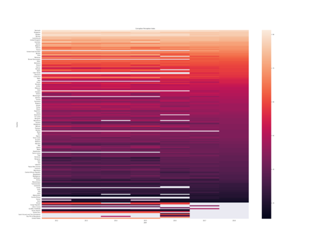

# Corruption around the world and over the time

 <small>Click on the image to expand</small>

Transparency International delivers each year the Corruption Perception Index.
It scores each country between 0 and 100, where near to 0 are more corrupt
countries and near to 100 are less corrupt countries. The heatmap shows data
from 2012 to 2018.

Resources:

- <a href="https://github.com/jailop/data_science/blob/master/cpi/cpi_by_year.csv" target="_blank">Dataset</a>
- <a href="https://github.com/jailop/data_science/blob/master/cpi/cpi_by_year.ipynb" target="_blank">Notebook</a>
