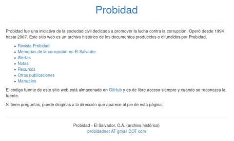

# Projects

## Restoring Probidad's site

Probidad was an anti-corruption civil society organization based in El Salvador.
It operated from 1994 to 2007. I am recovering and structuring its historical
information in a public web site: <http://probidad.net>.

- Period: Mar-Sep/2019
